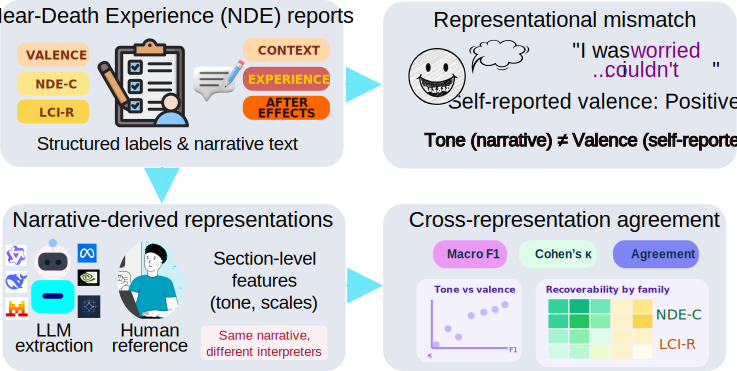

# NDE Narratives Analysis

Structured workflow for Near-Death Experience (NDE) narratives, including preprocessing, LLM extraction, sentiment baselines, human annotation workflows, and evaluation against majority-vote human references.

## Quick Menu

- [What This Repository Is](#what-this-repository-is)
- [Choose Your Path](#choose-your-path)
- [Video Summary](#video-summary)
- [Installation](#installation)
- [Minimal Configuration](#minimal-configuration)
- [Core Commands](#core-commands)
- [Interactive Demos](#interactive-demos)
- [Artifacts and Outputs](#artifacts-and-outputs)
- [Documentation Map](#documentation-map)
- [Repository Principles](#repository-principles)

## What This Repository Is

This repository is the full local research workflow. It is designed for:

- reproducible preprocessing and experiment execution
- multiple LLM experiments with resumable artifacts
- human annotation integration and evaluation
- detailed comparison reports and uncertainty analysis

Workflow overview:



## Choose Your Path

### Path A: Full research workflow (recommended)

Use this path when you want reproducible experiments and full evaluation.

1. Configure local paths and models.
2. Run preprocessing.
3. Run one or more LLM experiments.
4. Run evaluation and reports.

### Path B: Fast public preview

If you only want quick interactive testing without local setup, use the public lightweight Space:

- https://huggingface.co/spaces/cpulido/NDE-NARRATIVES-ANALYSIS

<p align="center">
  <video src="demo_video.mov" controls width="760" autoplay muted></video>
</p>

Note: the Space is intentionally lightweight and not a replacement for this full local pipeline.

## Video Summary

Short overview of article-aligned findings and the narrative-vs-questionnaire framing:

<p align="center">
  <video src="Stories_vs_Surveys.mov" controls width="760"></video>
</p>

Fallback direct link: [`Stories_vs_Surveys.mov`](Stories_vs_Surveys.mov)

## Installation

Windows PowerShell:

```powershell
python -m venv .venv
.\.venv\Scripts\Activate.ps1
pip install -e .[dev]
Copy-Item config\paths.example.toml config\paths.local.toml
```

Linux or macOS:

```bash
python3 -m venv .venv
source .venv/bin/activate
pip install -e .[dev]
cp config/paths.example.toml config/paths.local.toml
```

For local UI mode, install extras:

```bash
pip install -e .[ui]
```

If `nde` is not available in your shell, run commands as:

- Windows: `python -m nde_narratives.cli ...`
- Linux/macOS: `python3 -m nde_narratives.cli ...`

## Minimal Configuration

Start with this in `config/paths.local.toml`:

```toml
[paths]
data_dir = "D:/data/nde"
survey_csv = "D:/data/nde/results-survey.csv"
```

Then add runtime blocks as needed:

- `[translate]` for optional one-time translation
- `[preprocessing]` for segmentation/validation cleaning model
- `[llm]` and `[[llm.experiments]]` for downstream experiments

Default derived folders are created relative to `data_dir`.

## Core Commands

Use this sequence for most runs:

1. Validate setup

```bash
nde validate-config
```

2. Optional translation stage

```bash
nde translate
```

3. One-time preprocessing (validation + resegmentation)

```bash
nde preprocess
```

4. Smoke test

```bash
nde run-llm --experiment-id smoke_qwen08 --limit 2
```

5. Full experiments

```bash
nde run-llm --all-experiments
```

6. Evaluation

```bash
nde evaluate
```

Useful command options:

- `nde preprocess --from-scratch` resets preprocessing ledger/output state.
- `nde run-llm --min-valid-sections 3` keeps only rows with 3 valid sections.
- `nde run-llm --retry-exhausted` retries previously exhausted section tasks.
- `nde build-annotation-sample` creates annotation templates.
- `nde evaluate-uncertainty` computes bootstrap uncertainty summaries.

## Interactive Demos

### Local demo (Ollama)

```bash
nde local-demo
```

Supports:

- Guided mode (three sections) and complex mode (single narrative auto-segmentation)
- Stage-based pipeline view (input -> segmentation -> module analysis -> interpretation)
- Module tabs for tone estimation, structured features, and alignment layer
- Optional valence alignment check against overall experience-weighted tone
- Embedded local video summary when `Stories_vs_Surveys.mov` is present

Remote SSH access pattern:

```bash
ssh -L 7860:127.0.0.1:7860 <user>@<server>
```

Then open `http://127.0.0.1:7860`.

More details: [`docs/local_demo.md`](docs/local_demo.md)

### Public lightweight Space

- https://huggingface.co/spaces/cpulido/NDE-NARRATIVES-ANALYSIS

This is optimized for accessibility on shared infrastructure and is intended for quick exploration.

## Artifacts and Outputs

### Human artifacts

- Supports `.xlsx` / `.xls`
- Annotator IDs can come from filenames or manifests
- Folder-level `manifest.json` applies to all artifacts in that folder

### LLM artifacts

- Supports `.jsonl`, `.csv`, `.xlsx`, `.xls`
- Manifests are recommended for stable experiment metadata

### Main evaluation outputs

`nde evaluate` writes, at minimum:

- `evaluation_metrics.csv`
- `evaluation_summary.json`
- `human_reference_majority.csv`
- `human_agreement_pairwise.csv`
- `human_agreement_summary.csv`
- `alignment_report.md`

Detailed contracts: [`docs/output_contract.md`](docs/output_contract.md)

## Documentation Map

- [`docs/README.md`](docs/README.md): navigation index for all docs
- [`docs/llm_workflow.md`](docs/llm_workflow.md): end-to-end LLM execution guide
- [`docs/local_demo.md`](docs/local_demo.md): local UI usage and SSH notes
- [`docs/output_contract.md`](docs/output_contract.md): artifact formats and fields
- [`docs/benchmark_workflow.md`](docs/benchmark_workflow.md): external sentiment benchmark workflow
- [`docs/annotation_guidelines.md`](docs/annotation_guidelines.md): annotation protocol

## Repository Principles

- Real participant data is never committed.
- The repository versions code, prompts, schemas, docs, and synthetic fixtures.
- Runtime inputs/outputs live outside the repo via `config/paths.local.toml`.
- Human and LLM outputs are treated as traceable artifacts, not anonymous overwriteable files.

## Notes

- Prompt defaults for downstream analysis live in `prompts/analysis/`.
- Preprocessing prompt templates live in `prompts/preprocessing/`.
- `run-llm` applies valid-section filtering by default when valid-section columns are present (override with `--min-valid-sections`).
